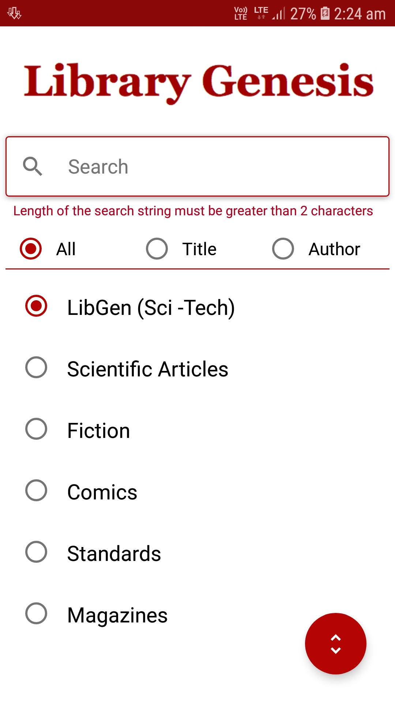
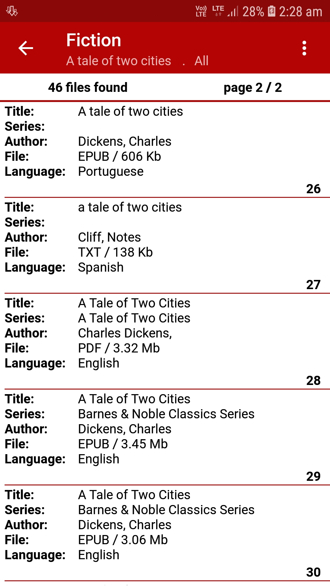
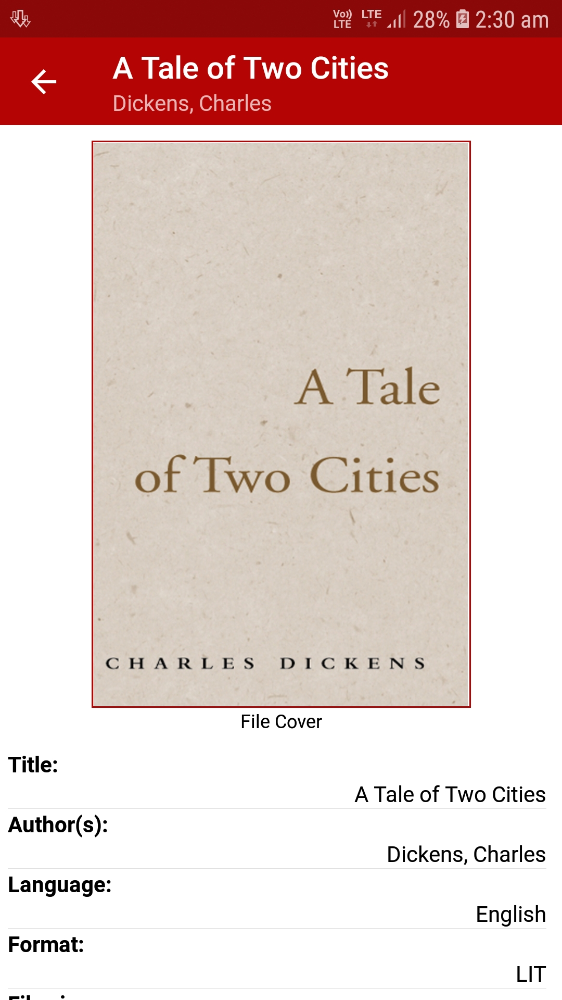
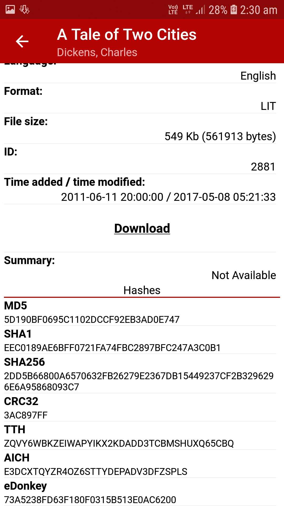

  

# Libgen

## Currently only Fiction is working, rest are still a work in progress .

A material design app to download books and papers from Library Genesis on the go.

## Features
* Download or save for later
* Search by title, author, series, genre

## Screenshots

  
  
  
  

## Requirements
Android 

## Download
You can find the [latest apk file here](http://gen.lib.rus.ec/) when the app is finished developing.

## Permissions
* Storage permission is required to download files from the app. 
* Internet permission is essential to use the app.

## Developers
All developers are welcome to commit changes on improving the code or adding more features!